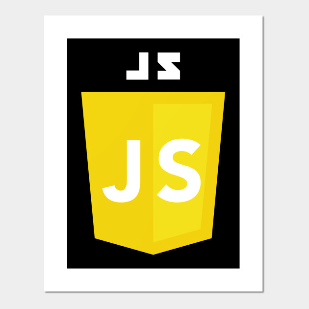

# Restaurant-page

<!--
*** Thanks for checking out this README Template. If you have a suggestion that would
*** make this better, please fork the repo and create a pull request or simply open
*** an issue with the tag "enhancement".
*** Thanks again! Now go create something AMAZING! :D
-->

<!-- PROJECT SHIELDS -->

  

  

    This project is part of the Microverse curriculum in JavaScript module!
  

<!-- TABLE OF CONTENTS -->

## Table of Contents

- [About the Project](#about-the-project)
- [Contributors](#contributors)
- [Acknowledgements](#acknowledgements)
- [License](#license)

## About The Project

This Restaurant website was built using DOM manipulation by dynamically rendering the whole pages of the website! The whole content of the website is generated by JavaScript. The website has:
- Home page
- Menu page (Dishes name and prices)
- Contact page (Restaurant contact and contact form to send a message)
- About page (The restaurant history)

  

[Project live link](https://rawcdn.githack.com/jstloyal/Restaurant-page/7bd586e99e04058f62da2f105d1288d9424f6ded/dist/index.html)

## Contributing

Contributions, issues and feature requests are welcome! Start by:

- Forking the project
- Cloning the project to your local machine
- `cd` into the project directory
- Run `git checkout -b your-branch-name`
- Make your contributions
- Push your branch up to your forked repository
- Open a Pull Request with a detailed description to the development branch of the original project for a review

### Built With

This project was built using these technologies.

- Javascript
- HTML/CSS
- ESlint
- VSCode editor
- Git-Flow

## Contributors

**Author**

​**Adetayo Sunkanmi**

- Github: [@jstloyal](https://github.com/jstloyal)
- Twitter: [@jstloyalty](https://twitter.com/jstloyalty)
- Linkedin: [Adetayo Sunkanmi](https://www.linkedin.com/in/jstloyalty)
- E-mail: jstloyalty@gmail.com

<!-- ACKNOWLEDGEMENTS -->

## Acknowledgements

- [Microverse](https://www.microverse.org/)
- [The Odin Project](https://www.theodinproject.com/)

## License

📝
This project is [MIT](https://opensource.org/licenses/MIT) licensed.
